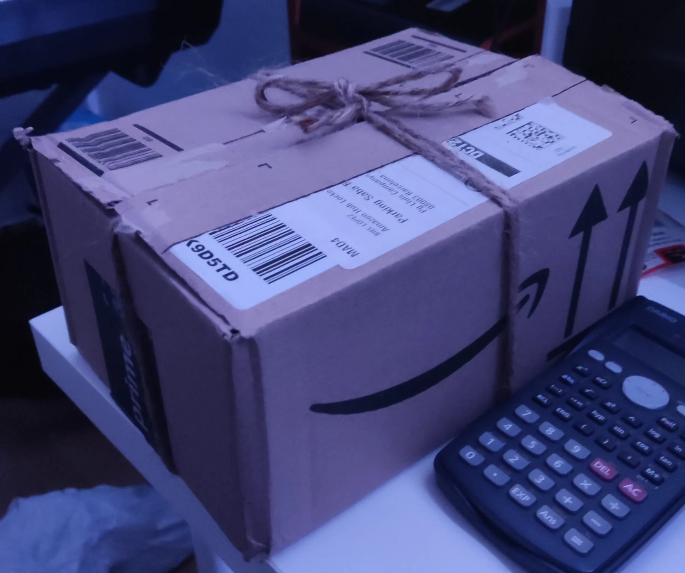
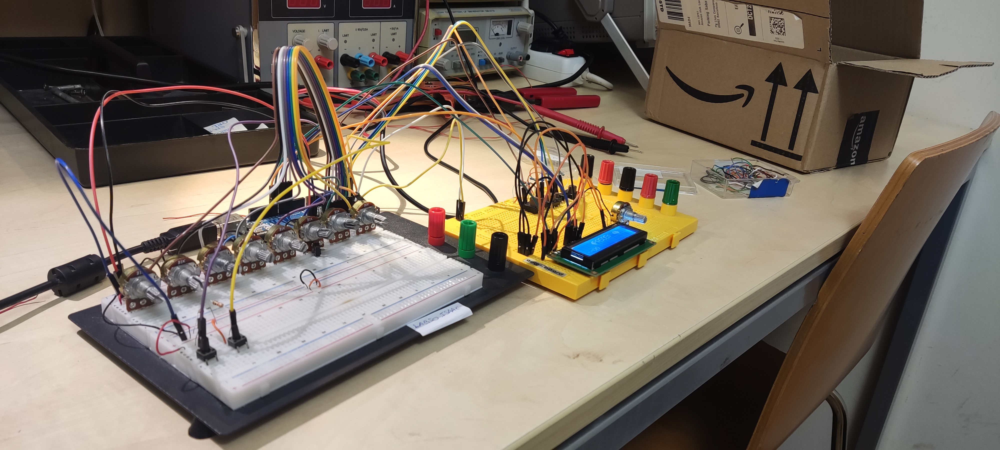

## 3/2/2026

Primera presentación del proyecto 

<i>Una caja</i>

## 10/02/2026

Se ha conseguido añadir hasta ocho potenciómetros y se ha empezado a trabajar la programación del muteado de los pasos. Tambien se ha conseguido editar la longitud de la secuencia desde el arduino:

<i>Protoboard en la fecha de la memoria</i>

