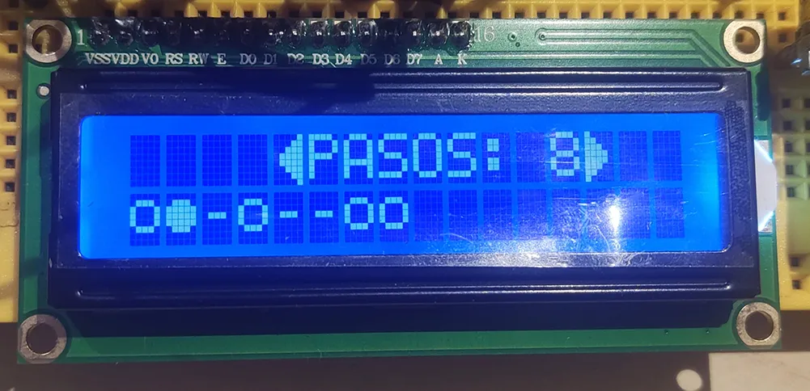

## 3/2/2026

Primera presentación del proyecto 

<div style="margin-bottom: 20px;"><p style="margin-top: 0px;"><sub><i>Una caja</i></sub></p></div>

## 10/02/2026

Se ha conseguido añadir hasta ocho potenciómetros y se ha empezado a trabajar la programación del muteado de los pasos. Tambien se ha conseguido editar la longitud de la secuencia desde el arduino:


<div style="margin-bottom: 20px;"><p style="margin-top: 0px;"><sub><i>Protoboard en la fecha de la memoria</i></sub></p></div>

## 17/02/2026

Se han añadido 8 botones para mutear cada uno de los potenciometros. También, se ha optimizado el código de dibujado de la pantalla para que solo cambie los caracteres que se mueven y no que redibuje todo cada vez que haces un cambio. Esto sobretodo es importante en el visionado de los pasos:

<div style="margin-bottom: 20px;"></div>

```javascript
inline void drawSteps() {
  if(mutesValue[nStep]){
    if(mutesValue[nStepAnterior]){
      lcd.setCursor(nStepAnterior, 1);
      lcd.write(byte(5));
      lcd.setCursor(nStep,1);
      lcd.write(byte(5));
    }
    else if(!mutesValue[nStepAnterior]){
      lcd.setCursor(nStepAnterior, 1);
      lcd.write(byte(6));
      lcd.setCursor(nStep,1);
      lcd.write(byte(5));
    }
  }
  else if(!mutesValue[nStep]){
    if(mutesValue[nStepAnterior]){
      lcd.setCursor(nStepAnterior, 1);
      lcd.write(byte(5));
      lcd.setCursor(nStep,1);
      lcd.write(byte(7));
    }
    else if(!mutesValue[nStepAnterior]){
      lcd.setCursor(nStepAnterior, 1);
      lcd.write(byte(6));
      lcd.setCursor(nStep,1);
      lcd.write(byte(7));
      
    }
  }
  nStepAnterior = nStep;
}
```

Se ha empezado también a trabajar la cuantización a escala y poder escoger desde los potenciometros, notas que pertenezcan a la escala escogida:

```arduino
int escalaSeleccionada = 1;
const int escalasNotas[5][13] = {
  {0, 1, 2, 3, 4, 5, 6, 7, 8, 9, 10, 11, 12}, //Escala cromática
  {0, 2, 3, 5, 7, 8, 10, 12, 0, 0, 0, 0, 0}, //Escala menor Natural
  {0, 2, 4, 5, 7, 9, 11, 12, 0, 0, 0, 0, 0}, //Escala Mayor
  {0, 2, 4, 6, 8, 10, 12, 0, 0, 0, 0, 0, 0}, //Escala de tonos
  {0, 1, 3, 4, 6, 7, 9, 10, 12, 0, 0, 0, 0} //Escala Semitono-tono
};
const int nNotasEscalas[5] = {13, 8, 8, 7, 9};

[...]

  for(int i = 0; i < numPotes; i++){
    int indice = constrain(map(analogRead(potesPin[i]), 1018, 30, 0, nNotasEscalas[escalaSeleccionada] - 1), 0, nNotasEscalas[escalaSeleccionada] - 1);
    int val = escalasNotas[escalaSeleccionada][indice];
```


Tambien se ha empezado a trabajar la gestión de las octavas, pudiendo ahora transportar toda la secuencia octavas hacia arriba y hacia abajo pulsando los botones de mute 1, 2 y 3, 4 respectivamente a la vez:

```arduino
      if(mutePulsado[0] && mutePulsado[1] && octava < 9 && tiempoActualMillis - ultimoTiempoBotonMute[0] > 250 && tiempoActualMillis - ultimoTiempoBotonMute[1] > 250){
        octava ++;
        ultimoTiempoBotonMute[0] = tiempoActualMillis;
        ultimoTiempoBotonMute[1] = tiempoActualMillis;
        timeShowOctValue = tiempoActualMillis;
        menuActual = 4;
        updateLCD = true;
      }
      else if(mutePulsado[2] && mutePulsado[3] && octava > 0 && tiempoActualMillis - ultimoTiempoBotonMute[2] > 250 && tiempoActualMillis - ultimoTiempoBotonMute[3] > 250){
        octava --;
        ultimoTiempoBotonMute[2] = tiempoActualMillis;
        ultimoTiempoBotonMute[3] = tiempoActualMillis;
        timeShowOctValue = tiempoActualMillis;
        menuActual = 4;
        updateLCD = true;
      }
      else if(tiempoActualMillis - TiempoPulsadoBotonMute[i] > 100 && tiempoActualMillis - ultimoTiempoBotonMute[i] > 250){
        mutesValue[i] = !mutesValue[i];
        ultimoTiempoBotonMute[i] = tiempoActualMillis;
        updateLCD = true;
```

Tambien se ha organizado la carpeta src del github por versiones añadiendo un log por cada una para ver los cambios. Ese log está hecho con gemini pasandole la version nueva y que analice que cambia con la versión antigua:

# LOG v1.2


